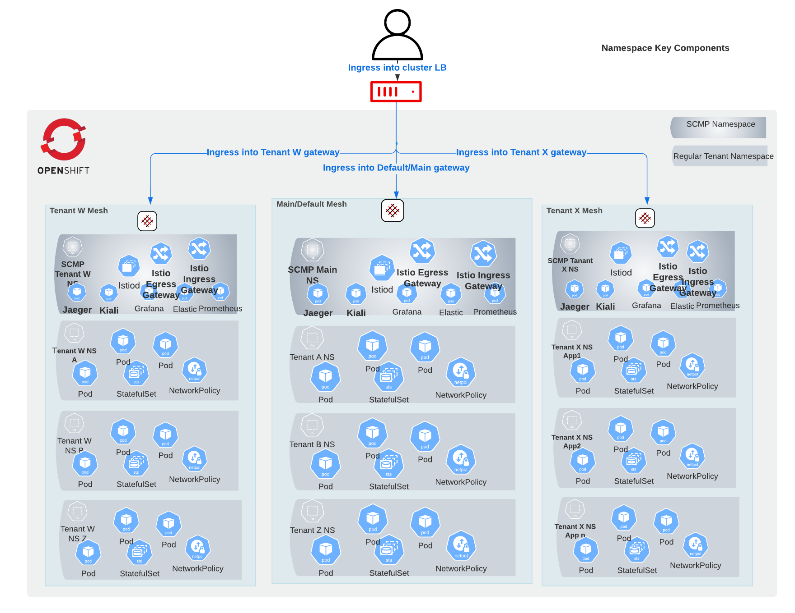

OpenShift Service Mesh Multi tenant Control Plane Deployment
==================================

This repository contains assets to enable a multi tenant deployment of the OpenShift Service Mesh control plane (ServiceMeshControlPlane and associated ServiceMeshMemberRoll) as well as any related services on an OpenShift Container Platform 4.9+. The ServiceMeshControlPlane (smcp) and the ServiceMeshMemberRoll (smmr) have to both be deployed to the same namespace.

## Overview

OpenShift Service Mesh (OSSM) consists of two logical components: a contol plane and a data plane. For more information see [OSSM architecture](https://docs.openshift.com/container-platform/4.11/service_mesh/v2x/ossm-architecture.html) and [OSSM official documentation](https://access.redhat.com/documentation/en-us/openshift_container_platform/4.10/html/service_mesh/index). OSSM supports several [deployment models](https://docs.openshift.com/container-platform/4.11/service_mesh/v2x/ossm-deployment-models.html) and can be installed using the [Red Hat OpenShift Service Mesh](https://docs.openshift.com/container-platform/4.11/service_mesh/v2x/installing-ossm.html). 
The focus of this repository is to assist in easily deploying the Control Plane in a multi tenant deployment model where multiple meshes are deployed on the same cluster. To do so you just need to deploy the chart multiple times once for each of the mesh to be deployed by providing the appropriate values for the deploment. 

The assets contained in this repository support deploying the control plane based on the provided templates and configuration files into the specified namespaces as well as deploying the bookinfo sample application in the designated test namespace to enable the testing of the configuration. 

## Prerequisites

The following prerequisites must be satisfied prior to deploying this application 

* OpenShift Container Platform 4.9+ with Administrative access
* Base Cluster logging installed (preferred but the ElasticSearch Operator can be installed instead) 
* Red Hat OpenShift Service Mesh and releated operators installed based on instructions [from](https://docs.openshift.com/container-platform/4.11/service_mesh/v2x/installing-ossm.html)  
* Tools
  * OpenShift Command Line Tool
  * [Git](https://git-scm.com/)
  * [Helm](https://helm.s/)
  * [OpenSSL](https://www.openssl.org) (Optional)

* Due to the namespace creation limitation of Helm 3.x for the time being it is recommneded that the namespace used for the smcp deployment and text application be created before hands or at the very minimum have the test namespace created and use the appropriate command option of helm to create the target smcp namespace
  
## Components

The primary assets contained within this repository is a Helm Chart to deploy the ServiceMeshControlPlane (represented by the smcp.yaml) and the ServiceMeshMemberRoll (represented by the smmr.yaml). In addition, there are a few optional custom resources (represented by the extra-crs.yaml) that can also be deployed and configured alongside the control plane.  Please refer to the [values.yaml](values.yaml) file for values that can be used to customize and control the installation. 

### OSSM Architecture 


### SMCP multi tenant deployment Architecture 



### SMCP multi tenant Data Flow 


## Installation and Deployment

With all of the prerequisites met and an overview of the components provided in this repository, execute the following commands to deploy the solution:

1. Clone the repository and change directory into the base directory
```
$ git clone https://github.com/cadjai/deploy-openshift-service-mesh-multi-tenant-control-plane.git && cd deploy-ossm-multi-tenant-smcp 
```

2. Login to OpenShift with a user with `cluster-admin` permissions

3. Customize your smcp values.yml file if necessary or use the helm command line options in the next command
  * Ensure you set the testnamespace.deploy to false to avoid the sample app being deployed before the mesh is ready
 
4. Deploy smcp 
  * without target namespace creation (pre-existing namespace)

     ```
     $ helm install main ./ -f values.yaml --debug --namespace main-smcp --wait
     ```
  * with target namespace creation (not recommended but can be done)

     ```
     $ helm install main ./ -f values.yaml --debug --namespace main-smcp --create-namespace --wait
     ```

5. Verify that you can view the deployed manifests in the target namespace

   * Navigate to the target namespace within the OpenShift console and verify that the smcp and smmr are deployed and review that the related workload is up. see [ossm installation guide](https://docs.openshift.com/container-platform/4.11/service_mesh/v2x/ossm-create-smcp.html) for more information on how to further customize the smcp if needed.

6. Deploy OSSM sample app for testing  
  * Update your smcp values.yml file by setting the testnamespace.deploy to true 

  * Change context into the project within with the smcp was deployed above using the oc command
     ```
     oc project main-smcp
     ```

  * Deploy the sample application 
      
     * without target namespace creation (pre-existing namespace)

      ```
      $ helm upgrade --install main ./ -f values.yaml --debug --namespace main-default-bf --wait
      ```
     * with target namespace creation (not recommended but can be done)

      ```
      $ helm upgrade main ./ -f values.yaml --debug --namespace main-default-bf --create-namespace --wait
      ```
      
7. Verify that you can view the deployed sample app in the target namespace

   * Navigate to the test application namespace to verify that it came up and follow steps documented in [ossm sample application](https://docs.openshift.com/container-platform/4.11/service_mesh/v2x/prepare-to-deploy-applications-ossm.html#ossm-tutorial-bookinfo-overview_ossm-create-mesh) for more information on accessing the application. 

   * Check that you can connect to the sample app using curl
      ```
      export GATEWAY_URL=$(oc -n main-smcp get route istio-ingressgateway -o jsonpath='{.spec.host}')
      echo $GATEWAY_URL
      curl -I http://$GATEWAY_URL/productpage 
      ```

8. If further integration is needed proceed with that. 
As an example of integration, you can integrate the Ingress gateway with various authentication and authorization flows. A common use case is to integrate the ingress gateway with a oauth-proxy. Below are a couple of examples of using oauth-proxy and oauth2-proxy with the OSSM ingress gateway. 
   * The ingress gateway can be configured to use RH SSO as an oauth2-proxy. For mor information check the [original repo](https://github.com/ghurel-rh/servicemesh-2-rhsso-examples.git) or [my forked updated version of the same repo](https://github.com/cadjai/servicemesh-2-rhsso-examples.git).

   * The ingress gateway can also be configured to use the OpenShift oauth server as an oauth-proxy. For mor information check the [oauth-proxy branch of the repo](https://github.com/cadjai/servicemesh-2-rhsso-examples/tree/ocp-oauth-proxy).
